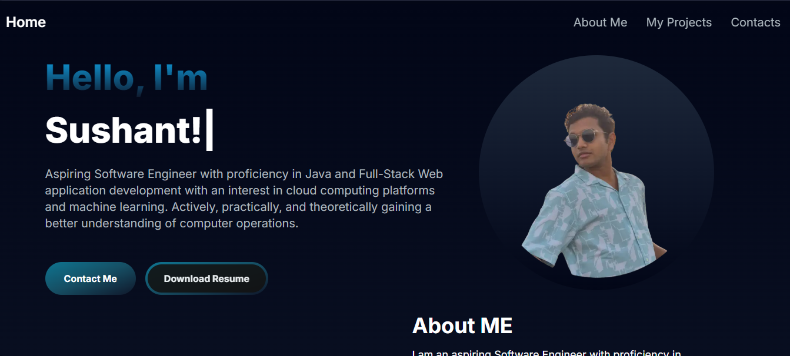
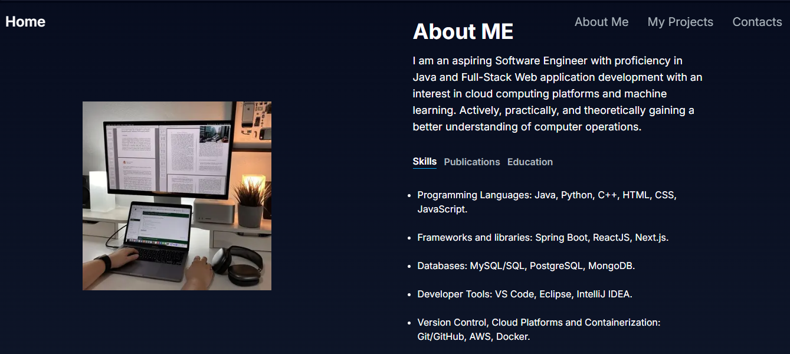
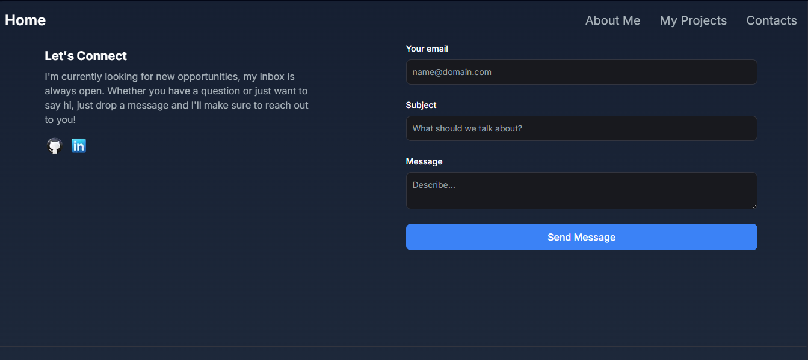

# My Portfolio

Welcome to my personal portfolio website. This project showcases my work, skills, and projects in a web-based format.





## Table of Contents

- [About](#about)
- [Features](#features)
- [Technologies Used](#technologies-used)
- [Installation](#installation)
- [Usage](#usage)
- [Contributing](#contributing)
- [License](#license)
- [Contact](#contact)

## About

This portfolio is designed to provide an overview of my professional experience, projects, and skills. It serves as a platform to highlight my work and provide visitors with a comprehensive understanding of my background.

## Features

- **Responsive Design**: Optimized for various devices and screen sizes.
- **Project Showcase**: Detailed descriptions and links to my website (https://www.sushantlanghi.online)
- **Contact Form**: Allows visitors to get in touch with me directly through the website.

## Technologies Used

- **Frontend**:
  - [React.js](https://reactjs.org/): A JavaScript library for building user interfaces.
  - [Next.js](https://nextjs.org/): A React framework for server-side rendering and static site generation.
  - [Tailwind CSS](https://tailwindcss.com/): A utility-first CSS framework for styling.

- **Backend**:
  - [Node.js](https://nodejs.org/): A JavaScript runtime for server-side development.

- **Deployment**:
  - [Vercel](https://vercel.com/): A platform for frontend developers, providing hosting and serverless functions.

## Installation

To run this project locally, follow these steps:

1. **Clone the repository**:

   ```bash
   git clone https://github.com/sushanttx/my-portfolio.git
   cd my-portfolio

2. **Install dependencies**

    ```bash
    npm install

## Usage

To start the development server:

    npm run dev


## Contributing

   Contributions are welcome! If you have suggestions or improvements, please create an issue or submit a pull request.

## Contact

   Feel free to reach out to me via sushant.langhi05@gmail.com
